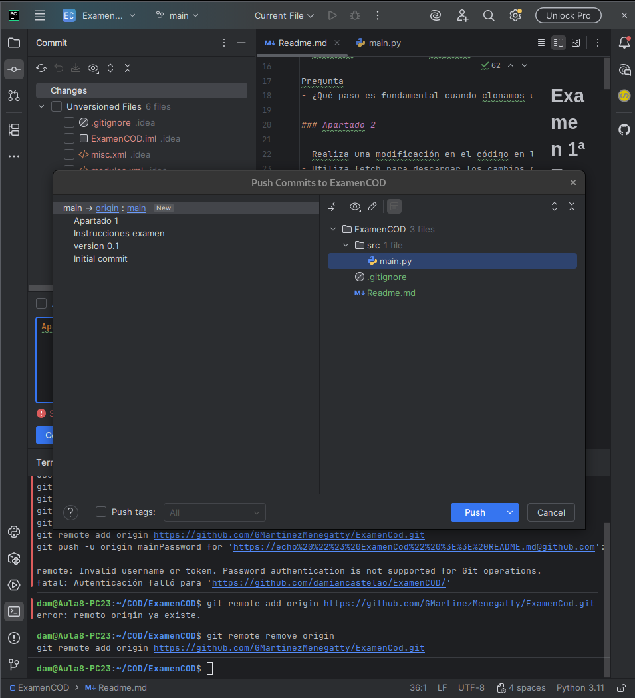
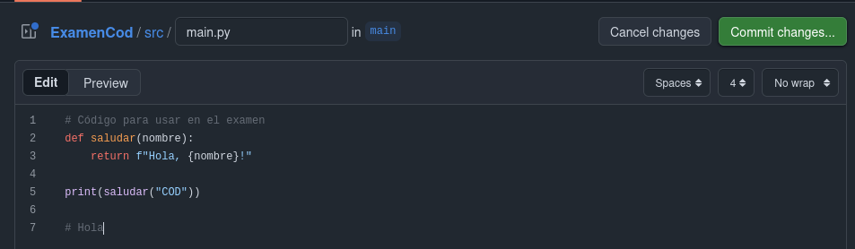
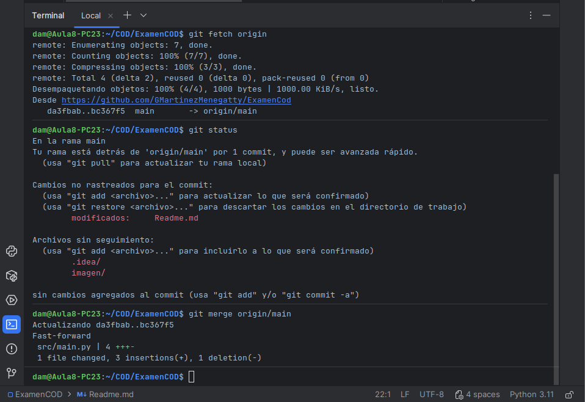
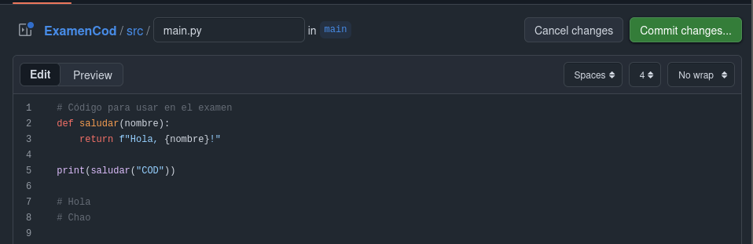
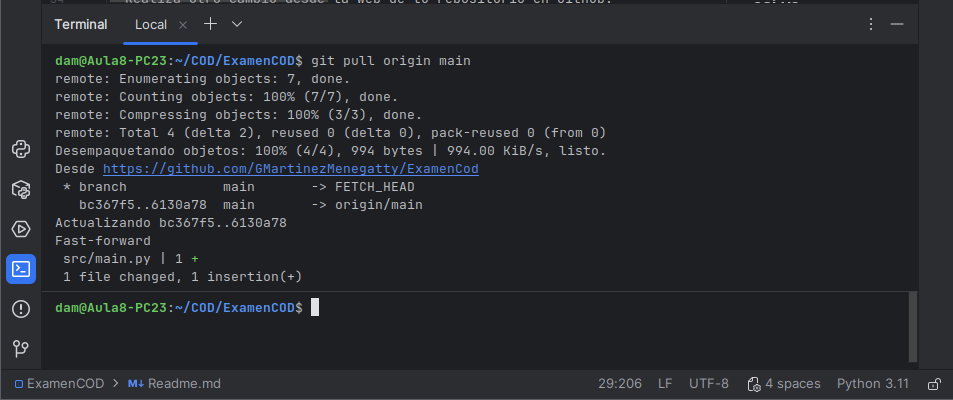

# Examen 1ª Evaluación (2ª Parte) - Control de Versiones

### Gabriela Sarai Martinez Menegatty

---

## Instrucciones
- Los commits de cada apartado deben tener el mensaje *"Apartado X - descripción del cambio realizado"*
- Entrega en la tarea de Moodle tu repositorio
- Solo se corrigen los commits que estén en el repositorio remoto

### Apartado 1

- Clona este repositorio.
- Modifica este Readme, poniendo tu nombre completo, realiza un `commit` con el mensaje *"Apartado 1"* y un `push`.

Pregunta 
- ¿Qué paso es fundamental cuando clonamos un repositorio ajeno para que podamos subir nuestros propios commits? Explícalo y utiliza capturas de pantalla.
### El paso fundamental es eliminar la rama anterior y añadirle la nueva direccion a tu propio repositorio, con el comando 'git remote remove origin' y 'git remote add origin' y la URL de tu repositorio.

### Apartado 2

- Realiza una modificación en el código en la web de tu repositorio en GitHub
- Utiliza fetch para descargar los cambios realizados en tu repositorio.

Pregunta
- Explica los pasos para que el código modificado en GitHub, llegue a tu rama principal local. Explícalo con capturas de pantalla.
### Primero debemos hacer el cambio en la web, luego debemos usar el comando 'git fetch origin' para finalizar escribimos el comando 'git merge origin/main' y asi ya tendremos los cambios en la rama local.

### Apartado 3

- Realiza otro cambio desde la web de tu repositorio en GitHub.
- Utiliza pull para descargar los cambios realizados en tu repositorio.

Pregunta
- Explica los pasos dados para que el cambio realizado en GitHub, llegue a tu rama principal local. Explícalo con capturas de pantalla.
### Primero hacemos el cambio en la web, seguido debemos realizar el comando 'git pull origin main' para que los cambios queden sincronizados, teniendo en cuenta que un pull es la combinacion de 'fetch' y 'merge'.

